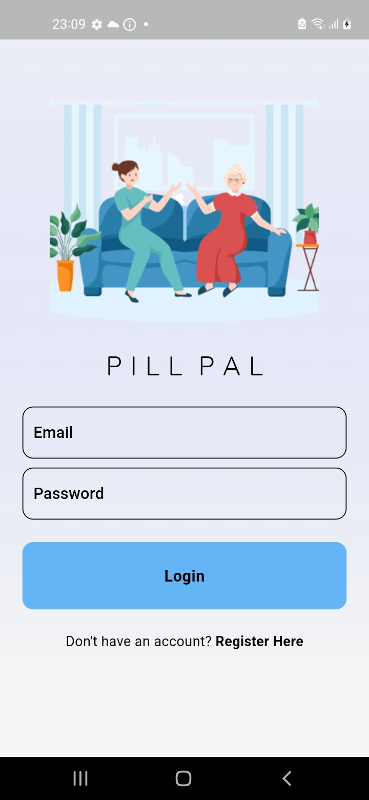
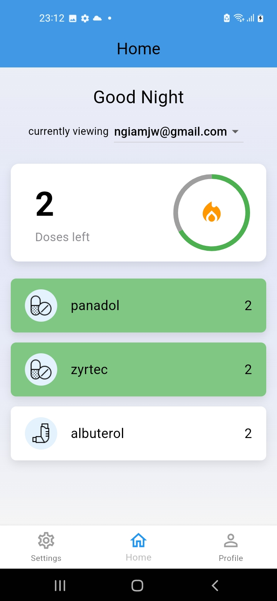
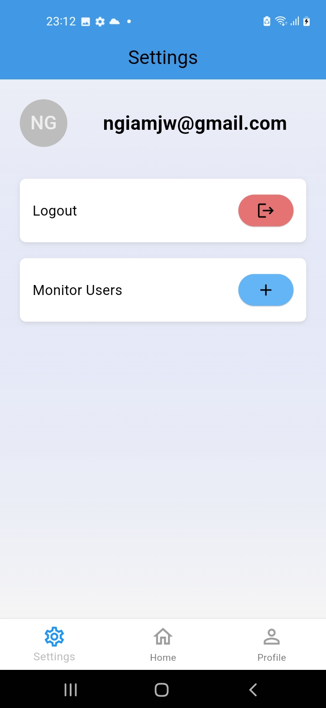
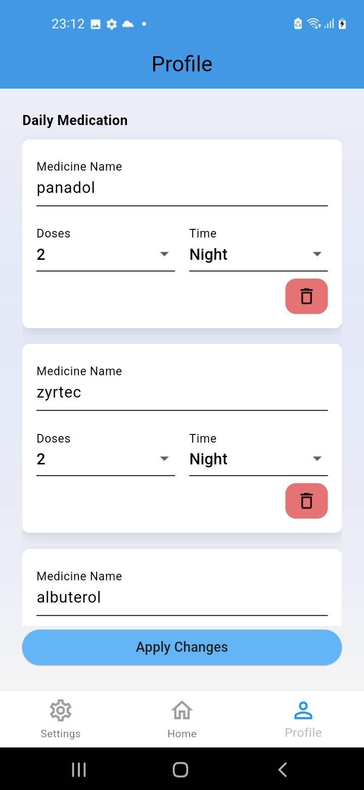

# Pill Pal – Pill Tracking App  

## Overview  
**Pill Pal** is a medication tracking app designed to help users manage their medication schedules while allowing caregivers to monitor their loved ones remotely. Built with security, accessibility, and real-time updates in mind, the app ensures that users never miss a dose while keeping their personal data protected.  

## Features  
- **Medication Tracking** – Users can log their daily doses and track medication history.  
- **Caregiver Monitoring** – Caregivers can remotely check if medication has been taken.  
- **Secure Authentication** – Only authorized users can access medical data.  
- **Real-Time Cloud Sync** – Data is stored in the cloud, allowing instant updates across devices.  
- **Smart Reminders** – Users receive notifications to take their medication.  
- **Caregiver Alerts** – Caregivers are notified if a user misses a dose.  
- **Minimalist UI** – Designed with simplicity to ensure ease of use, especially for the elderly.

## 📸 Screenshots  

| Login Screen  | Home Screen | Settings Screen | Profile Screen |
|--------------|------------|----------------|---------------|
|  |  |  |  |

## Inspiration  
The idea for Pill Pal was inspired by my grandparents, who often forgot to take their medication, making it difficult for my parents to track their health. With Singapore’s aging population in mind, I wanted to create a solution that simplifies medication tracking and supports caregivers in ensuring their loved ones stay on top of their prescriptions.  

## Tech Stack  
- **Frontend:** Flutter  
- **Backend:** Firebase (Authentication, Firestore, Cloud Functions)  


## Installation  
1. Clone the repository:  
   ```sh
   git clone https://github.com/ngiamjw/Pill-Pal.git
   ```
2. Install Dependencies:
      ```sh
   flutter pub get
   ```
3. Run the app:
      ```sh
   flutter run
   ```

## Developers
1. Ngiam Ju Wen (Team Lead)
2. Min Thi Ha
3. Elgin Er
